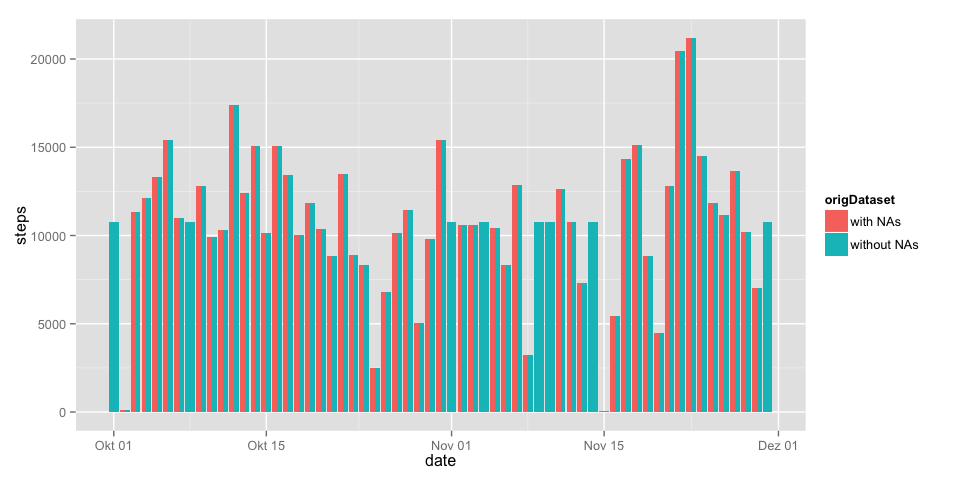

# Reproducible Research: Peer Assessment 1


## Loading and preprocessing the data

First, we are loading the activity.csv file into a data frame.


```r
activity <- read.csv("activity.csv")
```

Let's take a look at the data frame's structure and how the data might look like:

```r
str(activity)
```

```
## 'data.frame':	17568 obs. of  3 variables:
##  $ steps   : int  NA NA NA NA NA NA NA NA NA NA ...
##  $ date    : Factor w/ 61 levels "2012-10-01","2012-10-02",..: 1 1 1 1 1 1 1 1 1 1 ...
##  $ interval: int  0 5 10 15 20 25 30 35 40 45 ...
```

Since `date` is currently regarded as a factor we change its type to `Date`:

```r
activity$date <- as.Date(activity$date, format="%Y-%m-%d")
```

Now, we the date is structured like this:

```r
str(activity)
```

```
## 'data.frame':	17568 obs. of  3 variables:
##  $ steps   : int  NA NA NA NA NA NA NA NA NA NA ...
##  $ date    : Date, format: "2012-10-01" "2012-10-01" ...
##  $ interval: int  0 5 10 15 20 25 30 35 40 45 ...
```


## What is mean total number of steps taken per day?

In order to calculate the mean and median values we first calculate the total 
number of steps taken each day.


```r
totalStepsPerDay <- aggregate(steps ~ date, data = activity, FUN = "sum")
```

The data looks something like this:

```r
head(totalStepsPerDay)
```

```
##         date steps
## 1 2012-10-02   126
## 2 2012-10-03 11352
## 3 2012-10-04 12116
## 4 2012-10-05 13294
## 5 2012-10-06 15420
## 6 2012-10-07 11015
```

Thereafter, mean and median values can easily be derived.

```r
totalStepsPerDay_mean <- mean(totalStepsPerDay$steps)
totalStepsPerDay_median <- median(totalStepsPerDay$steps)
```

Mean (10766 total steps per day) and median (10765 total steps per day) values lie rather close together.

In order to get mean and median values, the `summary()` function could also be helpful.

```r
summary(totalStepsPerDay)
```

```
##       date                steps      
##  Min.   :2012-10-02   Min.   :   41  
##  1st Qu.:2012-10-16   1st Qu.: 8841  
##  Median :2012-10-29   Median :10765  
##  Mean   :2012-10-30   Mean   :10766  
##  3rd Qu.:2012-11-16   3rd Qu.:13294  
##  Max.   :2012-11-29   Max.   :21194
```


## What is the average daily activity pattern?

In order to plot a line graph of the average number of steps taken (averaged accross all days) in each 5-minute interval, we first aggregate the activity data once more. This time, we calculate the average number of steps per interval:


```r
avgStepsPerInterval <- aggregate(steps ~ interval, data = activity, FUN = "mean")

# just to show the avg. number of steps across all intervals in the graph as well
avgStepsAcrossIntervals <- mean(avgStepsPerInterval$steps)
```

Next, the dataset-index with the maximum number of steps and the corresponding interval can be calculated by:

```r
maxIndex <- which.max(avgStepsPerInterval$steps)
avgStepsPerInterval$steps[maxIndex]
```

```
## [1] 206.2
```

```r
avgStepsPerInterval$interval[maxIndex]
```

```
## [1] 835
```
Thus, we can state that across all the days in the dataset interval 835 contains the maximum number of steps. Namely 206.2.


Finally, a corresponding plot might be generated like this (using `ggplot2`):

```r
library(ggplot2)

ggplot(data = avgStepsPerInterval, aes(x = interval, y = steps)) + 
    geom_line() + 
    geom_point(data = avgStepsPerInterval[maxIndex, ], 
               aes(x = interval, y = steps), col = "darkgreen") +
    geom_vline(aes(xintercept=avgStepsPerInterval$interval[maxIndex]), 
               col = "darkgreen", linetype="dashed") +
    geom_hline(aes(yintercept=avgStepsPerInterval$steps[maxIndex]), 
               col = "darkgreen", linetype="dashed") +
    annotate("text", x = 200, y = avgStepsPerInterval$steps[maxIndex], 
             label=sprintf("Max. of %.1f steps\nin interval: %.0f", 
                           avgStepsPerInterval$steps[maxIndex], 
                           avgStepsPerInterval$interval[maxIndex]), 
             family = "serif", fontface = "italic", col = "darkgreen", size = 4) +
    geom_hline(aes(yintercept=avgStepsAcrossIntervals), col = "orange") +
    annotate("text", x = 200, y = avgStepsAcrossIntervals, 
             label=sprintf("Avg. of %.1f steps\nacross all intervals", 
                           avgStepsAcrossIntervals), 
             family = "serif", fontface = "italic", col = "orange", size = 4) + 
    ggtitle("Average Daily Activity Pattern")
```

 


## Imputing missing values

First, let's get an idea which and how many values are missing. Neither `date` nor `interval` column do have `NA` values:

```r
sum(is.na(activity$date))
```

```
## [1] 0
```

```r
sum(is.na(activity$interval))
```

```
## [1] 0
```

Apparently, some `steps` are missing:

```r
totalNumberOfNAs <- sum(is.na(activity$steps))
totalNumberOfObservations <- length(activity$steps)
missingPercentage  <- totalNumberOfNAs/totalNumberOfObservations * 100
```

2304 out of 17568 values in the given activity dataset are missing which is a percentage of 13.1%.

Secondly, we need a strategy for filling missing step values (`NA`): I have decided to fill in the mean value of steps for that particular 5-minute interval. This allows me to reuse the `avgStepsPerInterval` data frame:


```r
tempDf <- merge(x = activity, 
                y = avgStepsPerInterval, 
                by = "interval", 
                all.x = TRUE)

# fill NAs with mean of appropriate interval
tempDf[is.na(tempDf$steps.x),"steps.x"] <- tempDf[is.na(tempDf$steps.x),"steps.y"]

# and rename steps.x to steps
names(tempDf)[names(tempDf) == "steps.x"] <- "steps"

# finally create dataset equal to the original one but without NAs
activityWithoutNAs <- tempDf[order(tempDf$date, tempDf$interval), c("steps", "date", "interval")]
```

This gives us a dataset that is equal to the original dataset...

```r
str(activityWithoutNAs)
```

```
## 'data.frame':	17568 obs. of  3 variables:
##  $ steps   : num  1.717 0.3396 0.1321 0.1509 0.0755 ...
##  $ date    : Date, format: "2012-10-01" "2012-10-01" ...
##  $ interval: int  0 5 10 15 20 25 30 35 40 45 ...
```
...but without missing data

```r
sum(is.na(activityWithoutNAs$steps))
```

```
## [1] 0
```

Let's prepare the data for a histogram showing the total number of steps taken each day.

```r
withNAs <- activity
withNAs$origDataset <- "with NAs"
withoutNAs <- activityWithoutNAs
withoutNAs$origDataset <- "without NAs"

activities <- rbind(withNAs, withoutNAs)

activitiesPerDay <- aggregate(steps ~ origDataset + date, 
                              data = activities, FUN = "sum", na.rm = FALSE)
```

Furthermore, we need to take a look at mean and median values for total number of steps taken per day.

```r
aggregate(steps ~ origDataset, data = activitiesPerDay, 
          FUN = "mean")
```

```
##   origDataset steps
## 1    with NAs 10766
## 2 without NAs 10766
```

```r
aggregate(steps ~ origDataset, data = activitiesPerDay, 
          FUN = "median")
```

```
##   origDataset steps
## 1    with NAs 10765
## 2 without NAs 10766
```


```r
ggplot(data = activitiesPerDay, aes(x=date, y=steps, fill=origDataset)) + 
    geom_bar(stat = "identity", position = "dodge")
```

 


## Are there differences in activity patterns between weekdays and weekends?

To answer this question, we will first create a new dataset (based on the activity-dataset without missing values) that contains a new column `day` which holds one of the two factor values `weekday` or `weekend`.

```r
activitiesOnDays <- activityWithoutNAs

# create logical vectors for saturdays and sundays
sundays <- format(activitiesOnDays$date, "%w") == 0 
saturdays <- format(activitiesOnDays$date, "%w") == 6

# add new day-column and fill it with string weekend or weekday, respectively.
activitiesOnDays$day <- ifelse(sundays, "weekend", ifelse(saturdays, "weekend", "weekday"))

# make day a factor-column
activitiesOnDays$day <- as.factor(activitiesOnDays$day)
```

Calculate the mean value of steps per weekday/weekend and interval, which we need for the following line graph.

```r
avgStepsPerIntervalAndDay <- aggregate(steps ~ day + interval, data = activitiesOnDays, FUN = "mean")
```

And here is the plot, comparing average number of steps taken, averaged across all weekday days or weekend days:

```r
ggplot(data = avgStepsPerIntervalAndDay, aes(x = interval, y = steps)) + 
    geom_line() + facet_wrap(~ day, ncol = 1)
```

 
As can be seen from the graph, the activity tends to start later on a weekend day and does not reach the maximum of a weekday day. However, on average more steps in total are taken on a weekend day on average:


```r
avgTotalStepsPerWeekday <- sum(avgStepsPerIntervalAndDay[avgStepsPerIntervalAndDay$day == "weekday", ]$steps)

avgTotalStepsPerWeekend <- sum(avgStepsPerIntervalAndDay[avgStepsPerIntervalAndDay$day == "weekend", ]$steps)

avgTotalStepsPerWeekday
```

```
## [1] 10256
```

```r
avgTotalStepsPerWeekend
```

```
## [1] 12202
```


