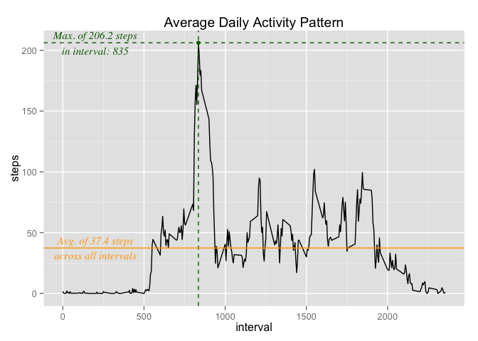

# Reproducible Research: Peer Assessment 1


## Loading and preprocessing the data

First, we are loading the activity.csv file into a data frame.


```r
activity <- read.csv("activity.csv")
```


Let's take a look at the data frame's structure and how the data might look like:

```r
str(activity)
```

```
## 'data.frame':	17568 obs. of  3 variables:
##  $ steps   : int  NA NA NA NA NA NA NA NA NA NA ...
##  $ date    : Factor w/ 61 levels "2012-10-01","2012-10-02",..: 1 1 1 1 1 1 1 1 1 1 ...
##  $ interval: int  0 5 10 15 20 25 30 35 40 45 ...
```


## What is mean total number of steps taken per day?

In order to calculate the mean and median values we first calculate the total 
number of steps taken each day.


```r
totalStepsPerDay <- aggregate(steps ~ date, data = activity, FUN = "sum")
```

The data looks something like this:

```r
head(totalStepsPerDay)
```

```
##         date steps
## 1 2012-10-02   126
## 2 2012-10-03 11352
## 3 2012-10-04 12116
## 4 2012-10-05 13294
## 5 2012-10-06 15420
## 6 2012-10-07 11015
```

Thereafter, mean and median values can easily be derived.

```r
totalStepsPerDay_mean <- mean(totalStepsPerDay$steps)
totalStepsPerDay_median <- median(totalStepsPerDay$steps)
```

Mean (10766 total steps per day) and median (10765 total steps per day) values lie rather close together.

In order to get mean and median values, the `summary()` function could also be helpful.

```r
summary(totalStepsPerDay)
```

```
##          date        steps      
##  2012-10-02: 1   Min.   :   41  
##  2012-10-03: 1   1st Qu.: 8841  
##  2012-10-04: 1   Median :10765  
##  2012-10-05: 1   Mean   :10766  
##  2012-10-06: 1   3rd Qu.:13294  
##  2012-10-07: 1   Max.   :21194  
##  (Other)   :47
```

The following boxplot gives a good idea about the distribution of total number of steps per day:


```r
boxplot(totalStepsPerDay$steps, ylab = "total number of steps per day")
```

 

## What is the average daily activity pattern?

In order to plot a line graph of the average number of steps taken (averaged accross all days) in each 5-minute interval, we first aggregate the activity data once more. This time, we calculate the average number of steps per interval:


```r
avgStepsPerInterval <- aggregate(steps ~ interval, data = activity, FUN = "mean")

# just to show the avg. number of steps across all intervals in the graph as well
avgStepsAcrossIntervals <- mean(avgStepsPerInterval$steps)
```

Next, the dataset-index with the maximum number of steps and the corresponding interval can be calculated by:

```r
maxIndex <- which.max(avgStepsPerInterval$steps)
avgStepsPerInterval$steps[maxIndex]
```

```
## [1] 206.2
```

```r
avgStepsPerInterval$interval[maxIndex]
```

```
## [1] 835
```
Thus, we can state that the maximum number of steps is 206.2 and happens to be in interval 835.


Finally, an according plot might be generated like this:

```r
library(ggplot2)

ggplot(data = avgStepsPerInterval, aes(x = interval, y = steps)) + 
    geom_line() + 
    geom_point(data = avgStepsPerInterval[maxIndex, ], 
               aes(x = interval, y = steps), col = "darkgreen") +
    geom_vline(aes(xintercept=avgStepsPerInterval$interval[maxIndex]), 
               col = "darkgreen", linetype="dashed") +
    geom_hline(aes(yintercept=avgStepsPerInterval$steps[maxIndex]), 
               col = "darkgreen", linetype="dashed") +
    annotate("text", x = 200, y = avgStepsPerInterval$steps[maxIndex], 
             label=sprintf("Max. of %.1f steps\nin interval: %.0f", 
                           avgStepsPerInterval$steps[maxIndex], 
                           avgStepsPerInterval$interval[maxIndex]), 
             family = "serif", fontface = "italic", col = "darkgreen", size = 4) +
    geom_hline(aes(yintercept=avgStepsAcrossIntervals), col = "orange") +
    annotate("text", x = 200, y = avgStepsAcrossIntervals, 
             label=sprintf("Avg. of %.1f steps\nacross all intervals", 
                           avgStepsAcrossIntervals), 
             family = "serif", fontface = "italic", col = "orange", size = 4) + 
    ggtitle("Average Daily Activity Pattern")
```

 


## Imputing missing values

First, let's get an idea of how many values are missing:

```r
totalNumberOfNAs <- sum(is.na(activity$steps))
totalNumberOfObservations <- length(activity$steps)
missingPercentage  <- totalNumberOfNAs/totalNumberOfObservations * 100
```

2304 out of 17568 values in the given activity dataset are missing which is a percentage of 13.1%.

Neither `date` nor `interval` column do have `NA` values:

```r
sum(is.na(activity$date))
```

```
## [1] 0
```

```r
sum(is.na(activity$interval))
```

```
## [1] 0
```


## Are there differences in activity patterns between weekdays and weekends?
