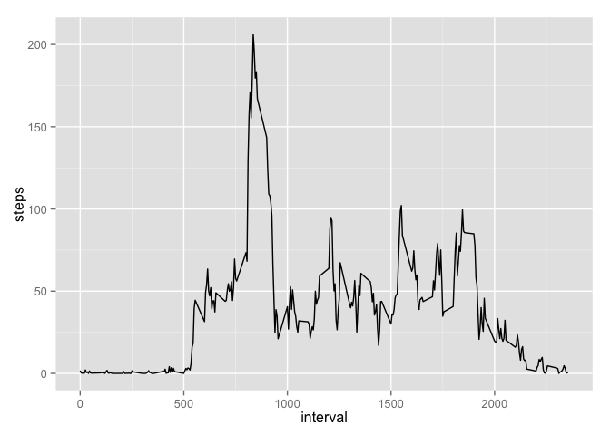

# Reproducible Research: Peer Assessment 1


## Loading and preprocessing the data

First, we are loading the activity.csv file into a data frame.


```r
activity <- read.csv("activity.csv")

# lets take a look at the first few entries
head(activity)
```

```
##   steps       date interval
## 1    NA 2012-10-01        0
## 2    NA 2012-10-01        5
## 3    NA 2012-10-01       10
## 4    NA 2012-10-01       15
## 5    NA 2012-10-01       20
## 6    NA 2012-10-01       25
```


## What is mean total number of steps taken per day?

In order to calculate the mean and median values we first calculate the total 
number of steps taken each day.


```r
totalStepsPerDay <- aggregate(steps ~ date, data = activity, FUN = "sum")

# which looks something like this
head(totalStepsPerDay)
```

```
##         date steps
## 1 2012-10-02   126
## 2 2012-10-03 11352
## 3 2012-10-04 12116
## 4 2012-10-05 13294
## 5 2012-10-06 15420
## 6 2012-10-07 11015
```

Thereafter, mean and median values can easily be derived.

```r
totalStepsPerDay_mean <- mean(totalStepsPerDay$steps)
totalStepsPerDay_median <- median(totalStepsPerDay$steps)
```

Mean (1.0766 &times; 10<sup>4</sup>) and median (10765) values 
lie close together.

In order to get mean and median values, the `summary()` function could also be helpful.

```r
summary(totalStepsPerDay)
```

```
##          date        steps      
##  2012-10-02: 1   Min.   :   41  
##  2012-10-03: 1   1st Qu.: 8841  
##  2012-10-04: 1   Median :10765  
##  2012-10-05: 1   Mean   :10766  
##  2012-10-06: 1   3rd Qu.:13294  
##  2012-10-07: 1   Max.   :21194  
##  (Other)   :47
```


The following boxplot gives a good idea about the distribution of total number of steps per day:


```r
boxplot(totalStepsPerDay$steps, ylab = "total number of steps per day")
```

 

## What is the average daily activity pattern?


```r
avgStepsPerInterval <- aggregate(steps ~ interval, data = activity, FUN = "mean")

library(ggplot2)

ggplot(data = avgStepsPerInterval, aes(x = interval, y = steps)) + geom_line()
```

 


## Imputing missing values


## Are there differences in activity patterns between weekdays and weekends?
